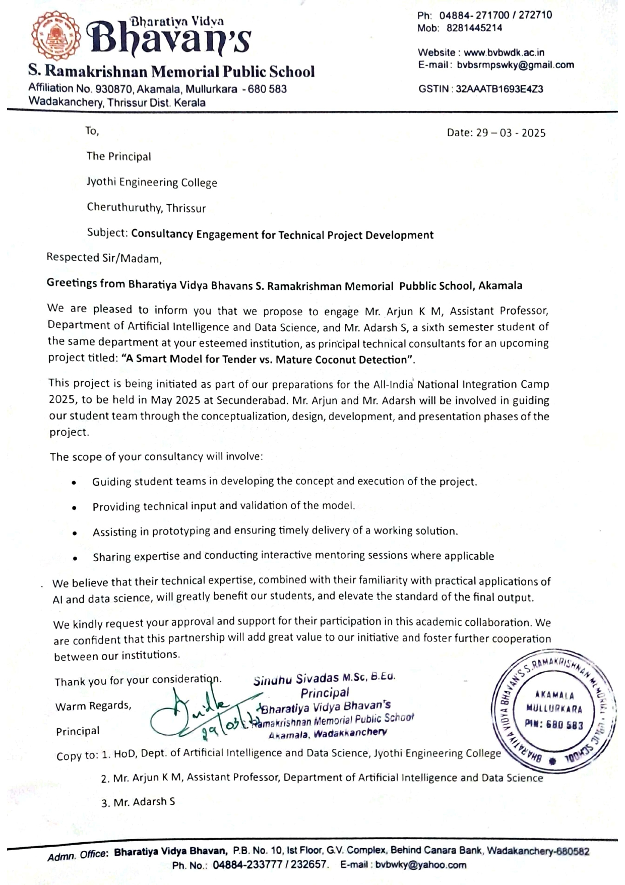
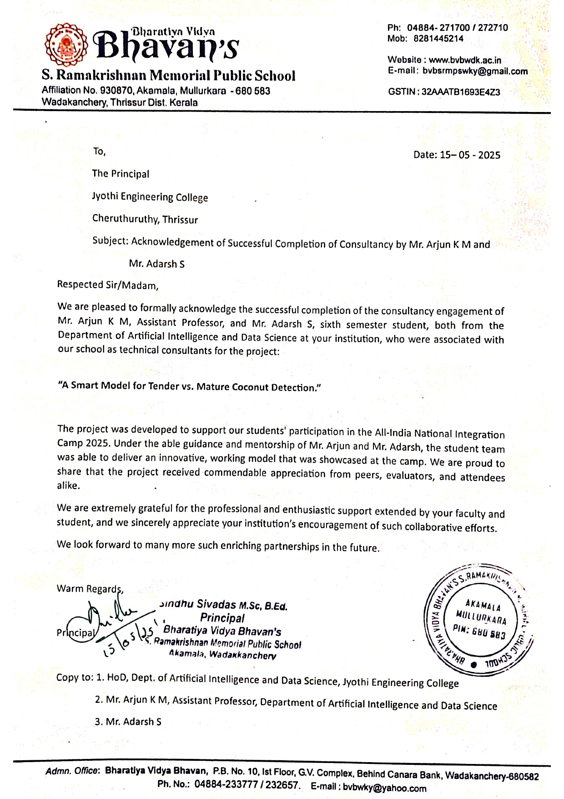

# 🥥 Coconut Detection Project

-----

## Project Overview

This project focuses on developing an automated system for coconut detection using **computer vision techniques**. The primary goal is to accurately identify coconuts in images or video streams, which can have various applications in agriculture, quality control, and harvesting processes.

This project was proudly developed for the students of **Bhavans Vidya School**. We are thrilled to announce that this work was successfully demonstrated by the students at the prestigious **All India National Integration Camp 2025**, showcasing their innovation and technical skills.

-----

<table>
  <tr>
    <td style="text-align: center; vertical-align: top;">
      <h3>Consultancy request</h3>
      
    </td>
    <td style="text-align: center; vertical-align: top;">
      <h3>Completion of consultancy</h3>
      
    </td>
  </tr>
</table>

-----
## Live demo
<table>
<tr>

</tr>
</table>
-----

## How It Works

The core of this project utilizes the **YOLOv8** (You Only Look Once) deep learning model, a state-of-the-art object detection algorithm known for its speed and accuracy.

The `test.py` script provided in this repository performs the following steps:

  * **Model Loading**: It loads a pre-trained YOLOv8 model (`best.pt`), which has been fine-tuned for coconut detection.
  * **Video Processing**: It reads an input video file (`Images and videos/*.mp4`).
  * **Inference**: For each frame of the video, the YOLOv8 model runs an inference to detect coconuts.
  * **Bounding Box Annotation**: If coconuts are detected with a confidence score above a specified percentage (defaulting to 0.2), bounding boxes are drawn around them.
  * **Labeling**: Each detected coconut is labeled with its class name (e.g., "coconut") and the confidence score.
  * **Output Generation**: The annotated frames are then written to a new output video file (`Output Video/*.mp4`).
  * **(Optional) Real-time Display**: The script also includes an optional feature to display the processed video in real-time.

-----

## Project Structure

```
.
├── Images and videos/
│   └── *.mp4           # Input video for demonstration
├── Output Video/
│   └── *.mp4     # Output video with detections (generated after running the script)
├── best.pt             # Pre-trained YOLOv8 model weights for coconut detection
└── test.py             # Main Python script for running the detection
```

-----

## Getting Started

To run this project locally, follow these steps:

### Prerequisites

  * **Python 3.x**
  * **`ultralytics`** library
  * **`opencv-python`** library

You can install the necessary Python libraries using pip:

```bash
pip install ultralytics opencv-python
```

### Installation

1.  **Clone the repository**:

    ```bash
    git clone https://github.com/Adarsh-S1/Coconut-Project.git
    cd Coconut-Project
    ```

2.  **Ensure model weights are present**: Make sure `best.pt` is in the root directory of the project.

3.  **Place your input video**: The `test.py` script is configured to read from `Images and videos/3.mp4`. Ensure your input video is located there, or update the `vedio_name` variable in `test.py` to point to your video file.

### Running the Detection

Execute the `test.py` script:

```bash
python test.py
```

The script will process the input video and save the output video with detected coconuts in the `Output Video/` folder.

-----

## Customization

You can customize the detection behavior by modifying the `test.py` script:

  * **`vedio_name`**: Change the path to your input video file.
  * **`output_name`**: Set a different name for the output video file.
  * **`output_folder`**: Specify a different directory for saving the output.
  * **`percentage`**: Adjust the confidence threshold for detections. Objects with a score below this percentage will not be displayed.

-----

## Future Enhancements

  * **Real-time Camera Feed**: Adapt the script to work with live camera feeds for immediate detection.
  * **Performance Optimization**: Further optimize the model for faster inference on various hardware.
  * **Counting and Tracking**: Implement features to count detected coconuts or track their movement over time.
  * **User Interface**: Develop a simple graphical user interface (GUI) for easier interaction.

-----

**Developed for Bhavans Vidya School** <br />
**Demonstrated at All India National Integration Camp 2025**